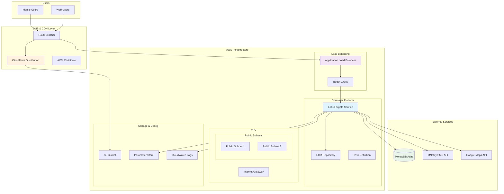

# MAMA - Maternal Health Companion

> **AI-powered maternal health platform for expectant mothers in Ghana**

[](https://www.terraform.io/)
[](https://aws.amazon.com/)
[](https://nodejs.org/)
[](https://reactjs.org/)

---

## Project Overview

MAMA is a comprehensive maternal health companion application designed to support expectant mothers in Ghana with AI-powered guidance, health tracking, and emergency services.

## System Architecture



### Technology Stack

| Component | Technology | Documentation |
|-----------|------------|---------------|
| **Frontend** | React 18 + TypeScript + Vite | [Frontend Guide](#frontendreact) |
| **Backend** | Node.js 18 + Express + MongoDB | [Backend Guide](#backendexpress-mongoose) |
| **Infrastructure** | AWS + Terraform | [DevOps Guide](#devopscloud) |

### Quick Start

Choose your development area:

- **Frontend Development**: [React + TypeScript Setup](#frontendreact)
- **Backend Development**: [Node.js + Express Setup](#backendexpress-mongoose)
- **Infrastructure/DevOps**: [AWS + Terraform Setup](#devopscloud)
- **Full Stack Development**: Follow all three guides

---

## Frontend/React

### Overview
Modern React application built with TypeScript, Vite, and Tailwind CSS for the MAMA platform frontend.

### Tech Stack
- **Framework**: React 18 with TypeScript
- **Build Tool**: Vite
- **Styling**: Tailwind CSS + shadcn/ui components
- **State Management**: React Query + Context API
- **Routing**: React Router v6
- **Forms**: React Hook Form + Zod validation

### Quick Start

```bash
cd frontend
npm install
npm run dev
```

### Project Structure
```
frontend/
├── src/
│   ├── components/          # Reusable UI components
│   │   ├── ai/             # AI assistant components
│   │   ├── auth/           # Authentication forms
│   │   ├── dashboard/      # Main dashboard
│   │   └── ui/             # shadcn/ui components
│   ├── lib/                # Utilities and API clients
│   ├── hooks/              # Custom React hooks
│   └── pages/              # Page components
├── public/                 # Static assets
└── package.json
```

### Configuration

**Frontend Environment (.env)**
```env
VITE_API_BASE_URL=http://localhost:5000/api
VITE_GOOGLE_MAPS_API_KEY=your_google_maps_key
```

### Key Features
- **Responsive Design**: Mobile-first approach for Ghana's mobile-heavy market
- **AI Chat Interface**: Real-time chat with maternal health AI assistant
- **Pregnancy Tracking**: Week-by-week pregnancy progress monitoring
- **Clinic Locator**: Google Maps integration for nearby healthcare facilities
- **Emergency Services**: Quick access to emergency contacts and services
- **Multilingual Support**: English and local Ghanaian languages

### Development Commands
```bash
# Development server
npm run dev

# Build for production
npm run build

# Preview production build
npm run preview

# Type checking
npm run type-check

# Lint code
npm run lint

# Run tests
npm run test
```

### Component Guidelines
- Use TypeScript for all components
- Follow shadcn/ui component patterns
- Implement proper error boundaries
- Use React Query for server state
- Follow accessibility best practices

---

## Backend/Express-Mongoose

### Overview
RESTful API server built with Node.js, Express, and MongoDB for the MAMA platform backend.

### Tech Stack
- **Runtime**: Node.js 18+
- **Framework**: Express.js
- **Database**: MongoDB with Mongoose ODM
- **Authentication**: JWT with refresh tokens
- **Validation**: Express Validator
- **Security**: Helmet, CORS, Rate Limiting
- **SMS Service**: MNotify API integration

### Quick Start

```bash
cd backend
npm install
cp .env.example .env
# Edit .env with your configuration
npm run dev
```

### Project Structure
```
backend/
├── src/
│   ├── controllers/        # Route handlers
│   ├── models/            # Mongoose schemas
│   ├── services/          # Business logic
│   ├── middleware/        # Express middleware
│   ├── routes/            # API routes
│   └── config/            # Configuration files
├── Dockerfile
└── package.json
```

### API Endpoints

| Method | Endpoint | Description |
|--------|----------|-------------|
| POST | `/api/auth/register` | User registration |
| POST | `/api/auth/login` | User login |
| GET | `/api/auth/profile` | Get user profile |
| POST | `/api/pregnancy/track` | Track pregnancy progress |
| GET | `/api/clinics/nearby` | Find nearby clinics |
| POST | `/api/emergency/alert` | Send emergency alert |
| POST | `/api/chat/message` | AI chat interaction |

### Configuration

**Backend Environment (.env)**
```env
# Database
MONGODB_URI=mongodb://localhost:27017/mama-app

# JWT Configuration
JWT_SECRET=your-jwt-secret
JWT_REFRESH_SECRET=your-refresh-secret
JWT_EXPIRES_IN=15m
JWT_REFRESH_EXPIRES_IN=7d

# SMS Service
MNOTIFY_API_KEY=your-mnotify-key
MNOTIFY_SENDER_ID=mama-app

# Security
BCRYPT_ROUNDS=12
RATE_LIMIT_WINDOW_MS=900000
RATE_LIMIT_MAX_REQUESTS=100

# CORS
CORS_ORIGIN=http://localhost:3000
```

### Development Commands

```bash
# Development server with hot reload
npm run dev

# Production server
npm start

# Run tests
npm test

# Lint code
npm run lint

# Check for security vulnerabilities
npm audit
```

### Key Features
- **Authentication**: JWT-based auth with refresh tokens
- **User Management**: Profile management and preferences
- **Pregnancy Tracking**: Week-by-week progress monitoring
- **AI Chat**: Integration with AI services for health guidance
- **SMS Notifications**: Appointment reminders and health tips
- **Emergency Services**: Quick emergency contact and alert system
- **Clinic Management**: Healthcare facility information and booking

### Database Models
- **User**: User profiles and authentication
- **Pregnancy**: Pregnancy tracking and milestones
- **ChatMessage**: AI chat conversation history
- **Clinic**: Healthcare facility information
- **EmergencyAlert**: Emergency contact and alert logs
- **Reminder**: Appointment and medication reminders

### Security Features
- Password hashing with bcrypt
- JWT token authentication
- Rate limiting and request validation
- CORS protection
- Input sanitization and XSS protection
- Helmet security headers

---

## DevOps/Cloud

### Overview
Production-ready AWS infrastructure for the MAMA platform built with Terraform following industry best practices for healthcare applications.

### Infrastructure Stack
- **Cloud Provider**: AWS
- **Infrastructure as Code**: Terraform
- **Container Orchestration**: ECS Fargate
- **Load Balancing**: Application Load Balancer
- **CDN**: CloudFront
- **Secrets Management**: AWS Parameter Store
- **Monitoring**: CloudWatch

### Quick Start

**Get your infrastructure running in 30 minutes:**

1. [**Prerequisites**](#prerequisites) - Install required tools
2. [**Bootstrap**](#bootstrap-setup) - Initialize Terraform state
3. [**Deploy**](#deployment-phases) - Launch infrastructure
4. [**Verify**](#verification) - Test everything works

### Prerequisites

| Tool | Version | Purpose |
|------|---------|---------|
| **Terraform** | ≥ 1.0 | Infrastructure provisioning |
| **AWS CLI** | ≥ 2.0 | AWS service interaction |
| **Docker** | ≥ 20.0 | Container building |

**Installation:**
```bash
# macOS
brew install terraform awscli docker

# Linux
curl -fsSL https://apt.releases.hashicorp.com/gpg | sudo apt-key add -
sudo apt-add-repository "deb [arch=amd64] https://apt.releases.hashicorp.com $(lsb_release -cs) main"
sudo apt-get update && sudo apt-get install terraform
```

**AWS Configuration:**
```bash
aws configure
# Enter your AWS credentials and region
```

### Project Structure
```
iac/
├── environments/
│   └── dev/                # Development environment
│       ├── main.tf         # Main infrastructure
│       ├── variables.tf    # Input variables
│       ├── terraform.tfvars # Actual values
│       └── outputs.tf      # Infrastructure outputs
├── modules/                # Reusable components
│   ├── alb/               # Application Load Balancer
│   ├── cloudfront/        # CDN configuration
│   ├── ecr/               # Container registry
│   ├── ecs/               # Container orchestration
│   ├── iam/               # Identity & Access Management
│   ├── parameter-store/   # Secrets management
│   └── shared/            # VPC & networking
└── state-bootstrap/       # Initial setup
```

### Bootstrap Setup

```bash
cd iac/state-bootstrap
terraform init
terraform apply -auto-approve
```

### Deployment Phases

#### Phase 1: Foundation (10 minutes)
```bash
cd ../environments/dev

# Comment out dependent modules in main.tf:
# module "alb", module "ecs", module "cloudfront"

terraform init
terraform apply
```

#### Phase 2: Load Balancer (5 minutes)
```bash
# Uncomment module "alb" in main.tf
terraform apply
```

#### Phase 3: Backend Application (10 minutes)
```bash
# Build and push backend image
cd ../../../scripts
./build-and-push.sh

# Update terraform.tfvars with image URI
# Uncomment module "ecs" in main.tf
cd ../iac/environments/dev
terraform apply
```

#### Phase 4: Frontend Application (5 minutes)
```bash
# Uncomment module "cloudfront" in main.tf
terraform apply

# Deploy frontend
cd ../../../scripts
./deploy-frontend.sh
```

### Infrastructure Components

**ECS (Elastic Container Service)**
- Serverless container orchestration
- Auto-scaling based on demand
- Health checks and automatic recovery

**ALB (Application Load Balancer)**
- HTTP/HTTPS load balancing
- SSL termination with ACM certificates
- Health checks for backend services

**CloudFront (CDN)**
- Global content delivery
- SSL certificate for custom domain
- Caching optimization for SPA

**Parameter Store**
- Secure configuration management
- Encrypted secrets storage
- Environment-specific values

### Configuration

**Required Secrets:**
```bash
# In terraform.tfvars
mongodb_uri = "your-mongodb-atlas-uri"
jwt_secret = "your-jwt-secret"
jwt_refresh_secret = "your-refresh-secret"
mnotify_api_key = "your-mnotify-key"
google_maps_api_key = "your-maps-key"
```

### Monitoring & Operations

**Health Checks:**
- Backend: `https://api.auto-hive.site/api/health`
- Frontend: `https://auto-hive.site`

**CloudWatch Logs:**
- Application logs: `/ecs/mama-app-dev`
- Access logs: ALB access logs in S3

**Metrics:**
- ECS service CPU/memory utilization
- ALB request count and latency
- CloudFront cache hit ratio

### Troubleshooting

**Common Issues:**

*ECS Task Fails to Start:*
```bash
# Check logs
aws logs tail /ecs/mama-app-dev --follow

# Check service status
aws ecs describe-services --cluster mama-app-dev --services mama-app-dev-backend
```

*Application Not Accessible:*
```bash
# Check target health
aws elbv2 describe-target-health --target-group-arn <arn>

# Test backend directly
curl https://api.auto-hive.site/api/health
```

### Security

**Network Security:**
- VPC with private subnets
- Security groups with least privilege
- No direct internet access to backend

**Data Protection:**
- All data encrypted in transit (TLS 1.2+)
- Secrets encrypted at rest in Parameter Store
- MongoDB Atlas encryption enabled

**Access Control:**
- JWT-based authentication
- Role-based authorization
- API rate limiting

---

## Contributing

### Development Workflow

1. **Choose your area**: Frontend, Backend, or Infrastructure
2. **Follow the respective guide** above for setup
3. **Create feature branch**: `git checkout -b feature/your-feature`
4. **Make changes** following the established patterns
5. **Test thoroughly** using the provided commands
6. **Submit pull request** with clear description

### Code Standards

**All Areas:**
- Use consistent formatting and linting
- Write comprehensive tests
- Document new features
- Follow security best practices
- Use meaningful commit messages

**Adding New Sections:**
To add a new development area (e.g., Mobile/React Native), follow this pattern:

```markdown
## Mobile/React Native

### Overview
Brief description of the mobile application component.

### Tech Stack
- List of technologies used

### Quick Start
```bash
# Setup commands
```

### Project Structure
```
mobile/
├── src/
└── package.json
```

### Development Commands
```bash
# Common commands
```

### Key Features
- Feature list

### Configuration
Environment and setup details


---

## Support

**Documentation:**
- [AWS Documentation](https://docs.aws.amazon.com/)
- [React Documentation](https://reactjs.org/docs/)
- [Node.js Documentation](https://nodejs.org/docs/)

**Getting Help:**
- Create detailed issue reports
- Include logs and error messages
- Specify which component (Frontend/Backend/Infrastructure)
- Provide steps to reproduce

---

**Built with ❤️ for maternal health in Ghana**

*Empowering expectant mothers with AI-powered health guidance and support.*

