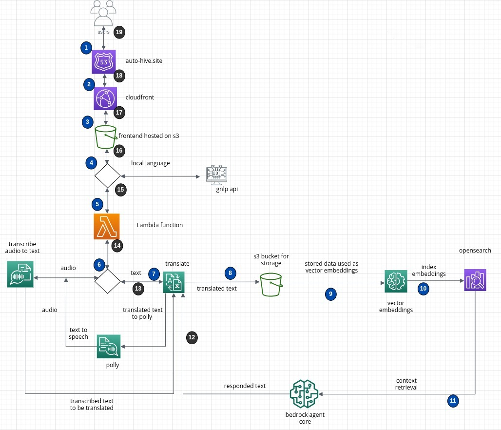
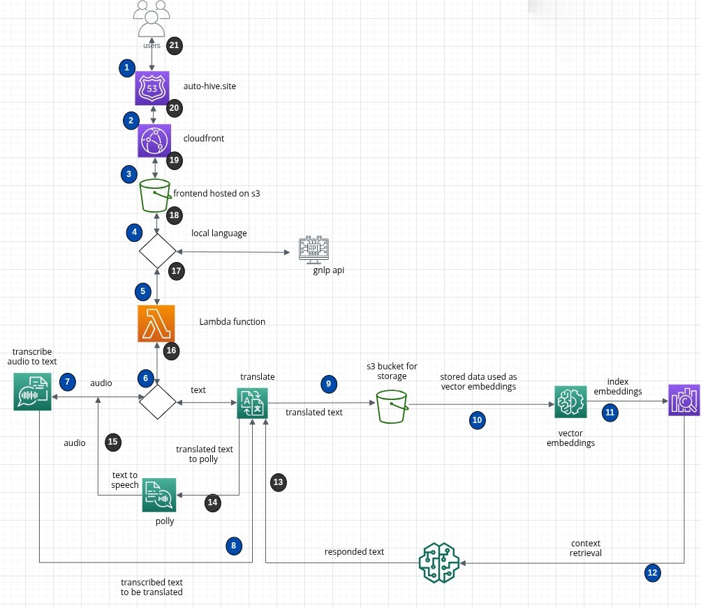
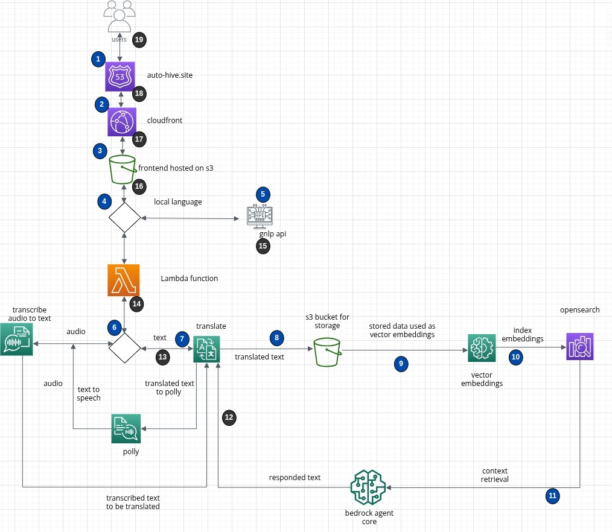

# MAMA - Maternal Health Companion

> **AI-powered maternal health platform for expectant mothers in Ghana**

[](https://www.terraform.io/)
[](https://aws.amazon.com/)
[](https://nodejs.org/)
[](https://reactjs.org/)

---

## Project Overview

MAMA is a comprehensive maternal health companion application designed to support expectant mothers in Ghana with AI-powered guidance, health tracking, and emergency services.

## System Architecture

### When Input-type = Text



### When Input-type = Audio



### When Input-type = Local Lang, Audio or Text



### 📹 Project Demo Video

[](https://drive.google.com/file/d/1lgDMoSw8x_tkLGfiLX4NYRO-ZrFVHra2/view?usp=sharing)

**[Watch the full demo video →](https://drive.google.com/file/d/1lgDMoSw8x_tkLGfiLX4NYRO-ZrFVHra2/view?usp=sharing)**

### 📊 Pitch Deck

[](https://app.presentations.ai/view/3qiLDmHp5D)

**[View the complete pitch deck →](https://app.presentations.ai/view/3qiLDmHp5D)**

**Live Environments:**

- [FRONTEND: https://dev.auto-hive.site](https://dev.auto-hive.site)
- [BACKEND: https://dev-api.auto-hive.site](https://dev-api.auto-hive.site)

### Technology Stack

| Component          | Technology                     | Documentation                             |
| ------------------ | ------------------------------ | ----------------------------------------- |
| **Frontend**       | React 18 + TypeScript + Vite   | [Frontend Guide](#frontendreact)          |
| **Backend**        | Node.js 18 + Express + MongoDB | [Backend Guide](#backendexpress-mongoose) |
| **Infrastructure** | AWS + Terraform                | [DevOps Guide](#devopscloud)              |

### Quick Start

Choose your development area:

- **Frontend Development**: [React + TypeScript Setup](#frontendreact)
- **Backend Development**: [Node.js + Express Setup](#backendexpress-mongoose)
- **Infrastructure/DevOps**: [AWS + Terraform Setup](#devopscloud)
- **Full Stack Development**: Follow all three guides

---

## Frontend/React

### Overview

Modern React application built with TypeScript, Vite, and Tailwind CSS for the MAMA platform frontend.

### Tech Stack

- **Framework**: React 18 with TypeScript
- **Build Tool**: Vite
- **Styling**: Tailwind CSS + shadcn/ui components
- **State Management**: React Query + Context API
- **Routing**: React Router v6
- **Forms**: React Hook Form + Zod validation

### Quick Start

```bash
cd frontend
npm install
npm run dev
```

### Project Structure

```
frontend/
├── src/
│   ├── components/          # Reusable UI components
│   │   ├── ai/             # AI assistant components
│   │   ├── auth/           # Authentication forms
│   │   ├── dashboard/      # Main dashboard
│   │   └── ui/             # shadcn/ui components
│   ├── lib/                # Utilities and API clients
│   ├── hooks/              # Custom React hooks
│   └── pages/              # Page components
├── public/                 # Static assets
└── package.json
```

### Configuration

**Frontend Environment (.env)**

```env
VITE_API_BASE_URL=http://localhost:5000/api
VITE_GOOGLE_MAPS_API_KEY=your_google_maps_key
```

### Key Features

- **Responsive Design**: Mobile-first approach for Ghana's mobile-heavy market
- **AI Chat Interface**: Real-time chat with maternal health AI assistant
- **Pregnancy Tracking**: Week-by-week pregnancy progress monitoring
- **Clinic Locator**: Google Maps integration for nearby healthcare facilities
- **Emergency Services**: Quick access to emergency contacts and services
- **Multilingual Support**: English and local Ghanaian languages

### Development Commands

```bash
# Development server
npm run dev

# Build for production
npm run build

# Preview production build
npm run preview

# Type checking
npm run type-check

# Lint code
npm run lint

# Run tests
npm run test
```

### Component Guidelines

- Use TypeScript for all components
- Follow shadcn/ui component patterns
- Implement proper error boundaries
- Use React Query for server state
- Follow accessibility best practices

---

## Backend/Express-Mongoose

### Overview

RESTful API server built with Node.js, Express, and MongoDB for the MAMA platform backend.

### Tech Stack

- **Runtime**: Node.js 18+
- **Framework**: Express.js
- **Database**: MongoDB with Mongoose ODM
- **Authentication**: JWT with refresh tokens
- **Validation**: Express Validator
- **Security**: Helmet, CORS, Rate Limiting
- **SMS Service**: MNotify API integration

### Quick Start

```bash
cd backend
npm install
cp .env.example .env
# Edit .env with your configuration
npm run dev
```

### Project Structure

```
backend/
├── src/
│   ├── controllers/        # Route handlers
│   ├── models/            # Mongoose schemas
│   ├── services/          # Business logic
│   ├── middleware/        # Express middleware
│   ├── routes/            # API routes
│   └── config/            # Configuration files
├── Dockerfile
└── package.json
```

### API Endpoints

| Method | Endpoint               | Description              |
| ------ | ---------------------- | ------------------------ |
| POST   | `/api/auth/register`   | User registration        |
| POST   | `/api/auth/login`      | User login               |
| GET    | `/api/auth/profile`    | Get user profile         |
| POST   | `/api/pregnancy/track` | Track pregnancy progress |
| GET    | `/api/clinics/nearby`  | Find nearby clinics      |
| POST   | `/api/emergency/alert` | Send emergency alert     |
| POST   | `/api/chat/message`    | AI chat interaction      |

### Configuration

**Backend Environment (.env)**

```env
# Database
MONGODB_URI=mongodb://localhost:27017/mama-app

# JWT Configuration
JWT_SECRET=your-jwt-secret
JWT_REFRESH_SECRET=your-refresh-secret
JWT_EXPIRES_IN=15m
JWT_REFRESH_EXPIRES_IN=7d

# SMS Service
MNOTIFY_API_KEY=your-mnotify-key
MNOTIFY_SENDER_ID=mama-app

# Security
BCRYPT_ROUNDS=12
RATE_LIMIT_WINDOW_MS=900000
RATE_LIMIT_MAX_REQUESTS=100

# CORS
CORS_ORIGIN=http://localhost:3000
```

### Development Commands

```bash
# Development server with hot reload
npm run dev

# Production server
npm start

# Run tests
npm test

# Lint code
npm run lint

# Check for security vulnerabilities
npm audit
```

### Key Features

- **Authentication**: JWT-based auth with refresh tokens
- **User Management**: Profile management and preferences
- **Pregnancy Tracking**: Week-by-week progress monitoring
- **AI Chat**: Integration with AI services for health guidance
- **SMS Notifications**: Appointment reminders and health tips
- **Emergency Services**: Quick emergency contact and alert system
- **Clinic Management**: Healthcare facility information and booking

### Database Models

- **User**: User profiles and authentication
- **Pregnancy**: Pregnancy tracking and milestones
- **ChatMessage**: AI chat conversation history
- **Clinic**: Healthcare facility information
- **EmergencyAlert**: Emergency contact and alert logs
- **Reminder**: Appointment and medication reminders

### Security Features

- Password hashing with bcrypt
- JWT token authentication
- Rate limiting and request validation
- CORS protection
- Input sanitization and XSS protection
- Helmet security headers

---

## DevOps/Cloud

### Overview

Production-ready AWS infrastructure for the MAMA platform built with Terraform following industry best practices for healthcare applications.

### Infrastructure Stack

- **Cloud Provider**: AWS
- **Infrastructure as Code**: Terraform
- **Compute**: EC2 (t3.micro) with Elastic IP
- **Configuration Management**: Ansible
- **Container Orchestration**: Docker Compose
- **Reverse Proxy**: Nginx with SSL termination
- **SSL/TLS**: Let's Encrypt (Certbot)
- **CDN**: CloudFront
- **Secrets Management**: AWS Parameter Store
- **Monitoring**: CloudWatch

### Cost Optimization

- **Previous Setup**: ECS Fargate + ALB (~$35-45/month)
- **Current Setup**: EC2 + Ansible (~$10-12/month)
- **Savings**: ~$25-35/month (60-80% reduction)

### Quick Start

**Get your infrastructure running in 30 minutes:**

1. [**Prerequisites**](#prerequisites) - Install required tools
2. [**Bootstrap**](#bootstrap-setup) - Initialize Terraform state
3. [**Deploy Infrastructure**](#deployment-phases) - Launch EC2 infrastructure
4. [**Configure with Ansible**](#ansible-setup) - Setup server configuration
5. [**Verify**](#verification) - Test everything works

### 📚 Documentation

- **[DevOps README](devops/README.md)** - Quick reference and commands
- **[Ansible Setup Guide](devops/ANSIBLE_SETUP_GUIDE.md)** - Complete configuration management

### 🚀 Deployment Quick Reference

| Phase       | Duration | What to Uncomment                          | Expected Resources                            |
| ----------- | -------- | ------------------------------------------ | --------------------------------------------- |
| **Phase 1** | 15 min   | Basic modules only                         | 48 resources (VPC, IAM, ECR, Parameter Store) |
| **Phase 2** | 5 min    | `module "alb"` + ALB outputs               | ALB + SSL certificate                         |
| **Phase 3** | 15 min   | `module "ecs"` + ECS outputs               | ECS cluster + backend service                 |
| **Phase 4** | 10 min   | `module "cloudfront"` + CloudFront outputs | S3 + CloudFront distribution                  |
| **Phase 5** | 5 min    | Update IAM dependencies                    | Complete infrastructure                       |

> **💡 Pro Tip**: Always run `terraform plan` before `terraform apply` to catch issues early!

### Prerequisites

| Tool          | Version | Purpose                     |
| ------------- | ------- | --------------------------- |
| **Terraform** | ≥ 1.0   | Infrastructure provisioning |
| **AWS CLI**   | ≥ 2.0   | AWS service interaction     |
| **Docker**    | ≥ 20.0  | Container building          |

**Installation:**

```bash
# macOS
brew install terraform awscli docker

# Linux
curl -fsSL https://apt.releases.hashicorp.com/gpg | sudo apt-key add -
sudo apt-add-repository "deb [arch=amd64] https://apt.releases.hashicorp.com $(lsb_release -cs) main"
sudo apt-get update && sudo apt-get install terraform
```

**AWS Configuration:**

```bash
aws configure
# Enter your AWS credentials and region
```

### Project Structure

```
iac/
├── environments/
│   └── dev/                # Development environment
│       ├── main.tf         # Main infrastructure
│       ├── variables.tf    # Input variables
│       ├── terraform.tfvars # Actual values
│       └── outputs.tf      # Infrastructure outputs
├── modules/                # Reusable components
│   ├── alb/               # Application Load Balancer
│   ├── cloudfront/        # CDN configuration
│   ├── ecr/               # Container registry
│   ├── ecs/               # Container orchestration
│   ├── iam/               # Identity & Access Management
│   ├── parameter-store/   # Secrets management
│   └── shared/            # VPC & networking
└── state-bootstrap/       # Initial setup
```

### Bootstrap Setup

```bash
cd iac/state-bootstrap
terraform init
terraform apply -auto-approve
```

### Deployment Phases

> **⚠️ Important**: Deploy modules in the correct sequence to avoid dependency issues.

#### Phase 1: Basic Infrastructure (15 minutes)

**Deploy foundational components first:**

```bash
cd ../environments/dev

# 1. Ensure only basic modules are uncommented in main.tf:
# ✅ module "parameter_store"
# ✅ module "iam"
# ✅ module "ecr"
# ✅ module "shared"
# ❌ module "alb" (commented out)
# ❌ module "ecs" (commented out)
# ❌ module "cloudfront" (commented out)

# 2. Deploy basic infrastructure
terraform init
terraform plan
terraform apply -auto-approve
```

**Expected Output:**

- ✅ 48 resources created
- ✅ ECR repository: `615299752577.dkr.ecr.eu-west-1.amazonaws.com/mama-app-dev-backend`
- ✅ GitHub Actions role: `arn:aws:iam::615299752577:role/mama-app-dev-github-actions-role`
- ✅ VPC, subnets, IAM roles, Parameter Store configured

#### Phase 2: Load Balancer (5 minutes)

**Add Application Load Balancer:**

```bash
# 1. Uncomment ALB module in main.tf:
# module "alb" {
#   source = "../../modules/alb"
#   ...
# }

# 2. Uncomment ALB outputs in outputs.tf:
# output "alb_dns_name" { ... }
# output "backend_url" { ... }

# 3. Deploy ALB
terraform plan
terraform apply -auto-approve
```

**Expected Output:**

- ✅ ALB created with SSL certificate
- ✅ Target group configured
- ✅ Backend URL available

#### Phase 3: Backend Application (15 minutes)

**Deploy ECS service with backend:**

```bash
# 1. Build and push backend Docker image
cd ../../../scripts
./build-and-push.sh

# 2. Update terraform.tfvars with the new image URI:
# backend_image = "615299752577.dkr.ecr.eu-west-1.amazonaws.com/mama-app-dev-backend:latest"

# 3. Uncomment ECS module in main.tf:
# module "ecs" {
#   source = "../../modules/ecs"
#   ...
# }

# 4. Uncomment ECS outputs in outputs.tf:
# output "ecs_cluster_name" { ... }

# 5. Deploy ECS service
cd ../iac/environments/dev
terraform plan
terraform apply -auto-approve
```

**Expected Output:**

- ✅ ECS cluster and service created
- ✅ Backend running on ECS Fargate
- ✅ Health checks passing
- ✅ Backend API accessible via ALB

#### Phase 4: Frontend Application (10 minutes)

**Deploy CloudFront and S3 for frontend:**

```bash
# 1. Uncomment CloudFront module in main.tf:
# module "cloudfront" {
#   source = "../../modules/cloudfront"
#   ...
# }

# 2. Uncomment CloudFront outputs in outputs.tf:
# output "frontend_url" { ... }
# output "cloudfront_domain_name" { ... }
# output "s3_bucket_name" { ... }
# output "cloudfront_distribution_id" { ... }

# 3. Deploy CloudFront
terraform plan
terraform apply -auto-approve

# 4. Deploy frontend to S3
cd ../../../scripts
./deploy-frontend.sh
```

**Expected Output:**

- ✅ S3 bucket for frontend static files
- ✅ CloudFront distribution created
- ✅ Frontend accessible via CloudFront URL
- ✅ SSL certificate configured

#### Phase 5: Update IAM Dependencies (5 minutes)

**Connect IAM to CloudFront:**

```bash
# 1. Update IAM module in main.tf to use CloudFront bucket:
# frontend_bucket_arn = module.cloudfront.s3_bucket_arn
# depends_on = [module.cloudfront]

# 2. Apply the IAM policy updates
terraform plan
terraform apply -auto-approve
```

**Final Verification:**

```bash
# Check all outputs
terraform output

# Test endpoints
curl https://dev-api.auto-hive.site/health  # Backend
```

### Ansible Setup

After deploying the EC2 infrastructure, use Ansible for configuration management:

```bash
# Install Ansible
pip install ansible

# Setup server configuration
cd scripts
./ansible-deploy.sh setup

# Deploy application updates
./ansible-deploy.sh deploy

# Check status
./ansible-deploy.sh status
```

**Benefits of Ansible over user-data scripts:**

- ✅ **Idempotent deployments** - Run multiple times safely
- ✅ **Easy updates** - Deploy new versions with single command
- ✅ **Environment consistency** - Same configuration every time
- ✅ **Rollback capability** - Easy to revert changes
- ✅ **Audit trail** - Track all configuration changes

For complete Ansible documentation, see [devops/ANSIBLE_SETUP_GUIDE.md](devops/ANSIBLE_SETUP_GUIDE.md).

````

### Infrastructure Components

**ECS (Elastic Container Service)**

- Serverless container orchestration
- Auto-scaling based on demand
- Health checks and automatic recovery

**ALB (Application Load Balancer)**

- HTTP/HTTPS load balancing
- SSL termination with ACM certificates
- Health checks for backend services

**CloudFront (CDN)**

- Global content delivery
- SSL certificate for custom domain
- Caching optimization for SPA

**Parameter Store**

- Secure configuration management
- Encrypted secrets storage
- Environment-specific values

### Configuration

**Required Secrets:**

```bash
# In terraform.tfvars
mongodb_uri = "your-mongodb-atlas-uri"
jwt_secret = "your-jwt-secret"
jwt_refresh_secret = "your-refresh-secret"
mnotify_api_key = "your-mnotify-key"
google_maps_api_key = "your-maps-key"
````

### Monitoring & Operations

**Health Checks:**

- Backend: `https://dev-api.auto-hive.site/health`
- Frontend: `https://dev.auto-hive.site`

**CloudWatch Logs:**

- Application logs: `/ecs/mama-app-dev`
- Access logs: ALB access logs in S3

**Metrics:**

- ECS service CPU/memory utilization
- ALB request count and latency
- CloudFront cache hit ratio

### Troubleshooting

**Deployment Phase Issues:**

_Phase 1 - Basic Infrastructure Fails:_

```bash
# Check if all required variables are set
terraform plan

# Verify AWS credentials
aws sts get-caller-identity

# Check for resource conflicts
terraform state list
```

_Phase 2 - ALB Module Errors:_

```bash
# Ensure VPC and subnets exist first
terraform output | grep vpc_id
terraform output | grep subnet

# Check ALB module dependencies
terraform plan -target=module.alb
```

_Phase 3 - ECS Service Won't Start:_

```bash
# Check ECS task logs
aws logs tail /ecs/mama-app-dev --follow

# Verify container image exists
aws ecr describe-images --repository-name mama-app-dev-backend

# Check service status
aws ecs describe-services --cluster mama-app-dev --services mama-app-dev-backend
```

_Phase 4 - CloudFront Issues:_

```bash
# Check S3 bucket exists
aws s3 ls | grep mama-app-dev

# Verify CloudFront distribution
aws cloudfront list-distributions --query 'DistributionList.Items[?Comment==`mama-app-dev-frontend`]'
```

**Common Issues:**

_ECS Task Fails to Start:_

```bash
# Check logs
aws logs tail /ecs/mama-app-dev --follow

# Check service status
aws ecs describe-services --cluster mama-app-dev --services mama-app-dev-backend
```

_Application Not Accessible:_

```bash
# Check target health
aws elbv2 describe-target-health --target-group-arn <arn>

# Test backend directly
curl https://dev-api.auto-hive.site/health
```

_Module Dependency Errors:_

```bash
# If you get "undeclared module" errors, check main.tf:
# - Ensure modules are uncommented in correct order
# - Check outputs.tf for references to undeclared modules
# - Run terraform plan to see dependency issues
```

### Security

**Network Security:**

- VPC with private subnets
- Security groups with least privilege
- No direct internet access to backend

**Data Protection:**

- All data encrypted in transit (TLS 1.2+)
- Secrets encrypted at rest in Parameter Store
- MongoDB Atlas encryption enabled

**Access Control:**

- JWT-based authentication
- Role-based authorization
- API rate limiting

---

## Contributing

### Development Workflow

1. **Choose your area**: Frontend, Backend, or Infrastructure
2. **Follow the respective guide** above for setup
3. **Create feature branch**: `git checkout -b feature/your-feature`
4. **Make changes** following the established patterns
5. **Test thoroughly** using the provided commands
6. **Submit pull request** with clear description

### Code Standards

**All Areas:**

- Use consistent formatting and linting
- Write comprehensive tests
- Document new features
- Follow security best practices
- Use meaningful commit messages

**Adding New Sections:**
To add a new development area (e.g., Mobile/React Native), follow this pattern:

````markdown
## Mobile/React Native

### Overview

Brief description of the mobile application component.

### Tech Stack

- List of technologies used

### Quick Start

```bash
# Setup commands
```
````

### Project Structure

```
mobile/
├── src/
└── package.json
```

### Development Commands

```bash
# Common commands
```

### Key Features

- Feature list

### Configuration

Environment and setup details

---

## Support

**Documentation:**

- [AWS Documentation](https://docs.aws.amazon.com/)
- [React Documentation](https://reactjs.org/docs/)
- [Node.js Documentation](https://nodejs.org/docs/)

**Getting Help:**

- Create detailed issue reports
- Include logs and error messages
- Specify which component (Frontend/Backend/Infrastructure)
- Provide steps to reproduce

---

**Built with ❤️ for maternal health in Ghana**

_Empowering expectant mothers with AI-powered health guidance and support._
